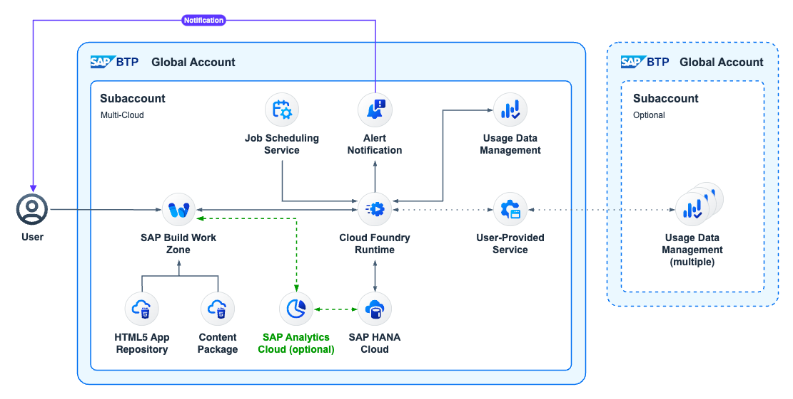

[](https://api.reuse.software/info/github.com/SAP-samples/btp-resource-consumption-monitor)

# BTP Resource Consumption Monitor

## Description

Application to monitor and alert on commercial and technical consumption of BTP services.


**Disclaimer:**
This tool is provided as-is and is not covered by SAP Support. This is not a replacement of the official billing documents you receive from SAP. The information provided by this tool is purely indicative.

## Requirements

The following Subscriptions are required to use this application:
- SAP HANA Cloud (you can re-use an existing instance)
- SAP Work Zone (Standard edition is sufficient)
<!-- - Your user needs to have either the `Global Account Viewer` or `Global Account Administrator` role *(TBC)* -->

The following Entitlements need to be available to use this application:
- Alert Notification: standard
- Authorization and Trust Management Service: application
- Destination service: lite
- HTML5 Application Repository Service: app-host
- Job Scheduling Service: standard
- SAP HANA Schemas & HDI Continers: hdi-shared
- Usage Data Management Service: reporting-ga-admin
- Application Logging Service: standard (optional service)

## Download and Installation

### 1. CF Application
In **Business Application Studio**, make sure to have a `Development Space` of kind `Full Stack Cloud Application` with the additional `Development Tools for SAP Build Work Zone` extension enabled.

`Clone` this repository in your environment and open the project.

#### Option A. Deploy with Alert Notification configuration (existing configuration will be overwritten):
***Important:*** First configure your email address in the notifications configuration file [mtaext_notifications.mtaext](/cf/mtaext_notifications.mtaext#L19)

```cmd
cd cf
npm install
mbt build
cf deploy ./mta_archives/BTPResourceConsumption_1.0.0.mtar -e mtaext_notifications.mtaext
```

#### Option B. Deploy without changing any Alert Notification configuration:
```cmd
cd cf
npm install
mbt build
cf deploy ./mta_archives/BTPResourceConsumption_1.0.0.mtar
```

### 2. Work Zone Content

#### Step 1. Build
```cmd
cd workzone
npm install
npm run build
```

This will create a `/workzone/package.zip` file.

#### Step 2.Deploy the package
In the **Work Zone Site Manager**, open the `Channel Manager` and:
1. Synchronize your HTML5 Repository
2. Click on `+ New` and upload the generated `/workzone/package.zip` file, specifying `btprc-srv` as Runtime Destination
3. Navigate to the `Site Directory` and make sure you have a site with the `view` setting set to `Spaces and Pages - New Experience`, and which has the `BTP Resource Consumption Role` role assigned.

### 3. Role Assignments
In the **BTP Cockpit**, go to the Security settings of your subaccount and assign the below 2 `Role Collections` to your user:
- `~btprc.cpkg_access_role` to access the Work Zone content (front-end)
- `BTPResourceConsumption Viewer` to access the CF Application (back-end)

## Access the application

Open the Work Zone site and navigate to the `BTP Credits` page.

## Run Locally
To run the application locally, you need to bind to the cloud service instances and run the application in hybrid mode. 
```
cds bind -2 btprc-uas,btprc-db,btprc-dest
cds-ts watch --profile hybrid
```

Open your browser to http://localhost:4004 where you will find the following `Web Applications`:
- /btprcreport/webapp
- /managealerts/webapp

**Tip:** This will connect to the HANA Cloud database. In case you want to use a local sqlite database for testing, run `cds deploy -2 sqlite`, and remove the binding to `btprc-db` from the `.cdsrc-private.json` file.

## Architecture


## Recurring Jobs
The application creates multiple jobs via the Job Scheduling Service: daily jobs to retrieve the consumption information for that day and monthly jobs to retrieve consumption information from past months. In its default configuration, the daily job will run every 3 hours. Typically the Usage Data Management API provides new data points around 6am UTC but this can vary.

## Switching Global Accounts
The application can be connected to a different Global Account to monitor that consumption instead of the Global Account where the application is deployed in (default).

To do so:
- Manually create an instance of the `Usage Data Management Service` service of plan `reporting-ga-admin` in the other Global Account. Create a `Service Key` on that service instance, and copy its contents.
- In the Global Account where the application is deployed, create a new `User Provided Service` in which you paste the service key contents.
- Adapt the `mta.yaml` on lines 35, 36 and 176, 183 to swap the bound standard service instance for the user-provided instance.

## Known Issues
- **Dynamic Tile**: In case the dynamic tile of the Report application does not show your forecasted CPEA credit for this month (but shows 3 dots instead), you will need to manually create a system mapping. In the `Work Zone Site Manager`, navigate to the `Settings` menu and go to `Alias Mapping`. Add a new alias with the following settings: Aliases = `sid(BTPRC.CPKG)` and Runtime Destination = `btprc-srv`.


## How to obtain support
[Create an issue](https://github.com/SAP-samples/btp-resource-consumption-monitor/issues) in this repository if you find a bug or have questions about the content.
 
For additional support, [ask a question in SAP Community](https://community.sap.com/t5/forums/postpage/choose-node/true/board-id/application-developmentforum-board).

## Contributing
If you wish to contribute code, offer fixes or improvements, please send a pull request. Due to legal reasons, contributors will be asked to accept a DCO when they create the first pull request to this project. This happens in an automated fashion during the submission process. SAP uses [the standard DCO text of the Linux Foundation](https://developercertificate.org/).

## Code of Conduct

See [Our Code of Conduct](CODE_OF_CONDUCT.md).

## License
Copyright (c) 2024 SAP SE or an SAP affiliate company. All rights reserved. This project is licensed under the Apache Software License, version 2.0 except as noted otherwise in the [LICENSE](LICENSE) file.
